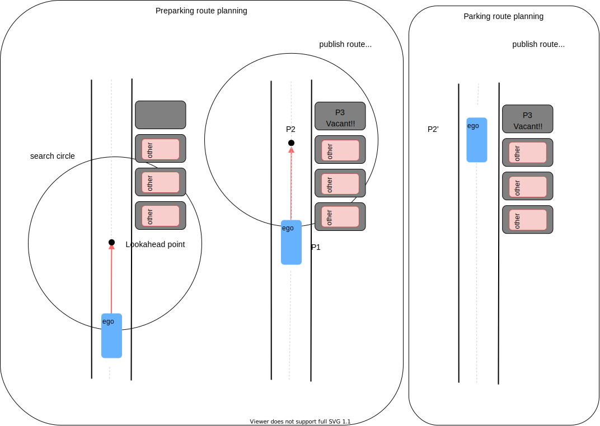

## Auto parking planner

## Purpose

駐車場(lanelet 的には parking lot)内のレーンを巡回し, 泊められそうな駐車枠(lanelet 的には parking space)を発見したら, その駐車枠に駐車するという機能(以下, 自動駐車)をもったノードを提供します. 自動駐車を実行するための前提条件として以下のものがあります.

- 開始時点で自動車が駐車場内にあること.
- 駐車場内に lanelet レーンがひいてあること.

## How it works

自動駐車のプランニングは以下の 3 フェーズに分割できます.

1. circular planning
   現在いるレーンを始点として, 駐車場内のすべてのレーンを通過するようなルートを計画します. もし, 駐車場内のレーンにループが存在しない場合の挙動は簡単で, 現在のレーンを始点とし, 駐車場の出口のレーンを終点とするようなルートを計画します. ループが存在する場合, 一旦は全てのループしているレーンを一度は通るような経路を計画するが, RouteHandler がループの生じる経路を扱えないという制約があるため, ループが生じないように経路を複数に分割し, 順にそれを publish する.

2. preparking planning
   走行中, 車から lookahead*distance だけ離れた場所を中心とする探索円内にあるすべての駐車候補地点に関して, 駐車可能かどうかを計算する. 駐車可能判定は例えば, 1. 駐車候補地点に駐車した場合にコストマップとのオーバーラップがないことや 2. lookahead point から駐車候補地点間を freespace planning algorithm を用いて経路計画した場合に実行可能解が存在することなどを用いる..
   これにより駐車可能だと判定された地点は全て, `std::vector<Pose> feasible_parking_goal_poses*`のメンバ変数に保存されます. 駐車可能判定で一箇所でも駐車可能な場所があることが確認できた時点で, P2(現在位置) -> P3(lookadhed point)の HADMapRoute を publish され, 自動車は一度停車する.
   なお, 上記の駐車可能判定が成功しないまま, circular planning が出した HADMapRoute の終端まできてしまった場合, circular planning phase に移行する.

3. parking planning
   再び engage を送ると, 車は lookahead point(P3)を目指して進み停車する. ここで実際に停車した位置を P3'とする. ここで, すべての`feasible_parking_goal_poses_`について再度 preparking の際と同じ基準を用いて駐車可能判定を行い, その判定により駐車可能と判断されたものの内, 最も駐車しやすい場所(e.g. euclid 距離が最も近い, astar で解いた場所のコストが最小)を選びそれを P4 とする. そして, P3'から P4 までの HADMapRoute を publish し自動駐車は終了する. もしも`feasible_parking_goal_poses_`で駐車可能判定が負の場合は, 再度 circular planning phase に移行する.

# Running on simulation

# Design
